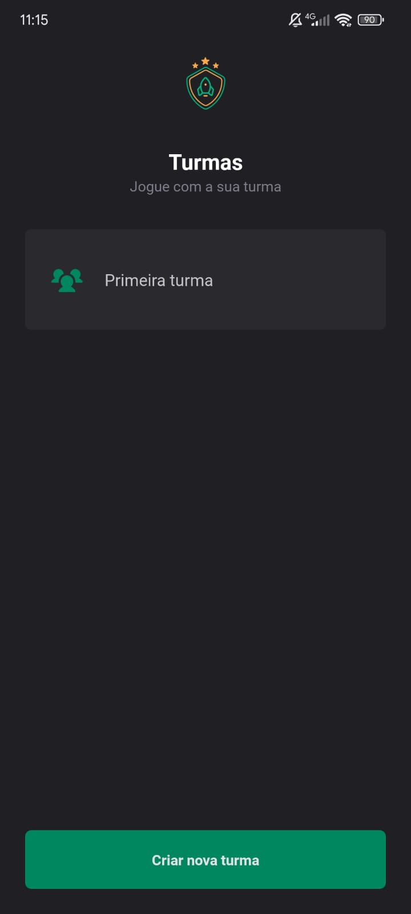

# Ignite Teams

## Table of contents

- [Overview](#overview) 
  - [The challenge](#the-challenge)
  - [Screenshot](#screenshot)
- [My process](#my-proccess)
  - [Built with](#build-with)
  - [Useful resources](#useful-resources)
- [Author](#author)

## Overview

### The challenge

Users should be able to:

- Create and delete groups
- Create teams inside the groups
- Create players inside the teams

### Screenshot

## My process

### Build with

- [TypeScript](https://www.typescriptlang.org/) - Typed programming language that builds on JavaScript
- [React.js](https://react.dev/) - JavaScript Library
- [Expo](https://expo.dev/) - Amazing tool for creating universal native apps with React that run on Android, iOS, and the web. 
- [Styled Components](https://styled-components.com/) - Amazing tool for CSS in JS styling. 
- [React Navigation](https://reactnavigation.org/) - Routing and navigation for Expo and React Native apps.
- [Phosphor Icons](https://phosphoricons.com/) - Beautiful & consistent icon library.

### Useful resources

- [Styled Components](https://styled-components.com/) - This is an amazing component library that helped me create easily styled components. I'd recommend it to anyone still using this library.

## Author

- GitHub - [@rodrigoqueiroz12](https://github.com/rodrigoqueiroz12)
- LinkedIn - [@rodrigoqueiroz](www.linkedin.com/in/rodrigo-queiroz-a113a9212)